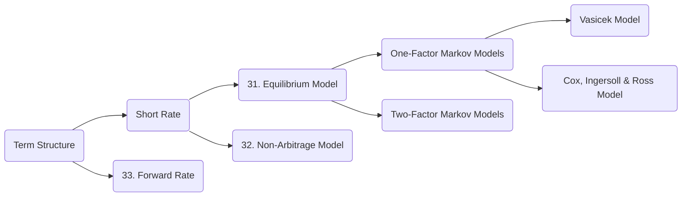
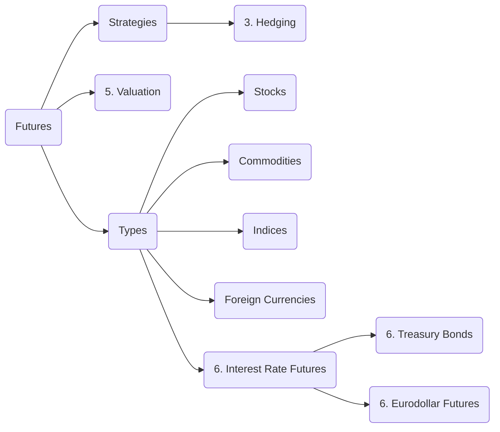
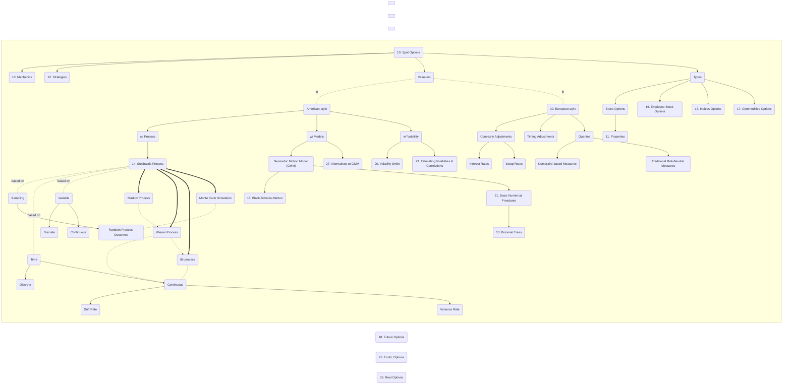
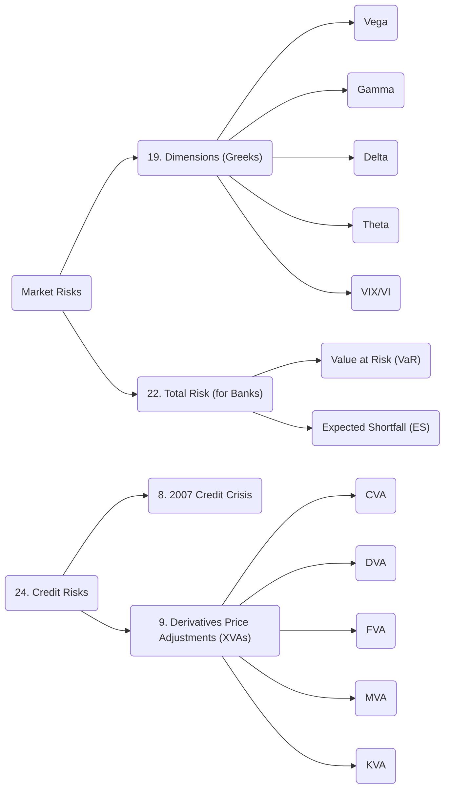

1_OptionsFuturesAndOtherDerivatives_SankarshanBasu_JohnHull_ed10_2018.pdf

This book's goal:

- Unifying framework for valuation of all types of derivatives.

# Derivatives Market (1-2, 8)

## Derivatives Market and How it is changing (1)

## How it works? (2)

## What are the different ways of transferring risks? (8)
- Forward Contract
- Futures Contract
- Option Contract
- Swap
- ==Securitization (8)==

---

# Interest Rates (4, 28-29,31-33)

## Interest Rate Derivatives (28-29)

### Valuation (28)

## Interest Rate Term Structure (31-33)

## LIBOR for Fixed Interest Rates

# Forward Contracts (5)

# Futures (3, 6)

## Hedging Strategies (3)

# Swaps (7, 34)

Vanilla Swaps
Compounding Swaps
Currency Swaps
Equity Swaps

# Options (10-24,26-27,30,36)

These are `vanilla` Option Contracts for Financial Assets

## Various Types & Inner Workings (10-18,20-21,23,26-27,30,36)

> `Exotic Options` (aka Exotics) are `Over The Counter (OTC)` derivative products for financial assets.

> `Real Options` are option contracts for real assets like land, buildings, plant and equipiments.

## Risks (19,20,22,24)

# Credit Derivatives (25)

# Energy & Commodity Derivatives (35)

---

Pending:
- Chapter 37