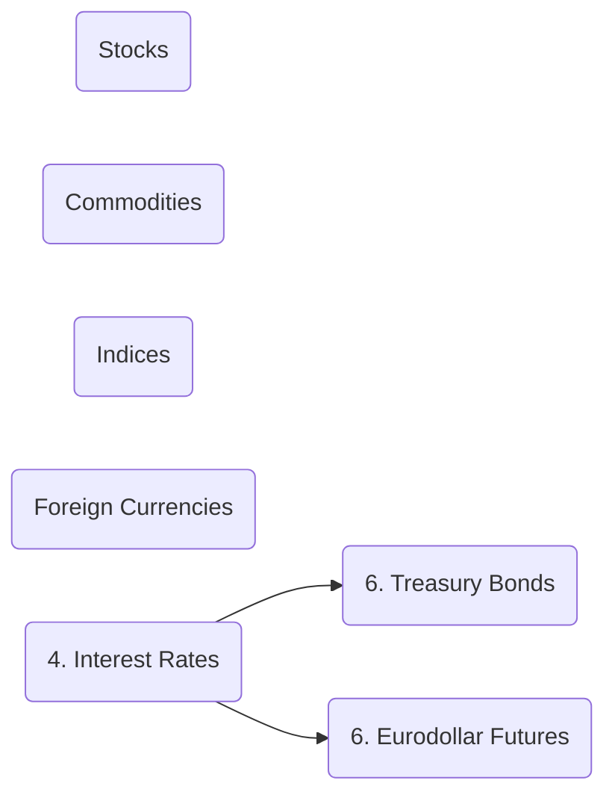
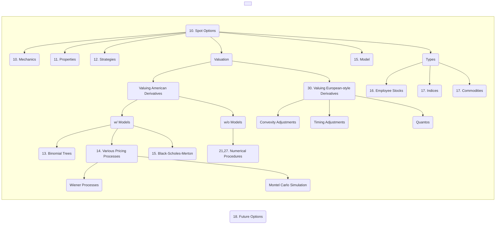
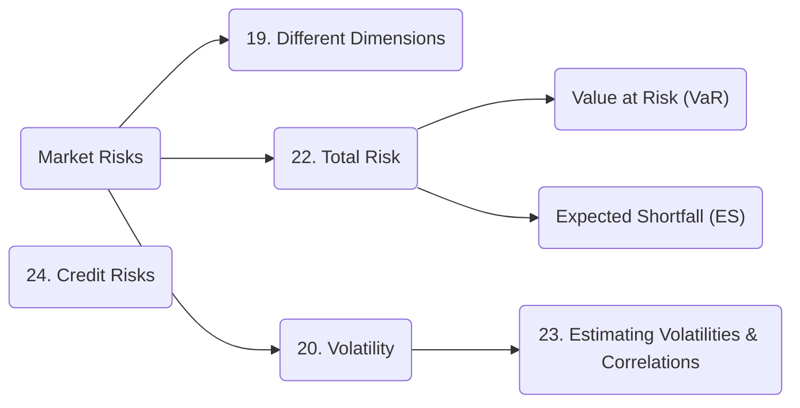
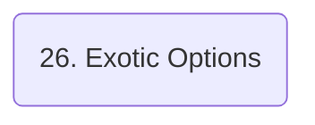

1_OptionsFuturesAndOtherDerivatives_SankarshanBasu_JohnHull_ed10_2018.pdf

# Derivative Market (1-2, 8)

## How derivative market works? (1-2)

## What are different ways of transferring risks? (8)
- Forward Contract
- Futures Contract
- Option Contract
- Swap
- ==Securiization (8)==

### 2007 Credit Crisis (8)

## What are various price adjustments important in derivative market? (9)

Derivatives are valued using following XVAs:

- Credit Valuation Adjustment (CVA)
- Debit Valuation Adjustment (DVA)
- Funding Valuation Adjustment (FVA)
- Margin Valuation Adjustment (MVA)
- Capital Valuation Adjustment (KVA)

---

# Interest Rates (4)

# Forward Contract (5)

# Futures Contract (3, 6)

## Hedging (3)

## Types (6)

# Swaps (7)

# Vanilla Option Contract for Financial Assets (10-24,27,30)

## Various Types & Inner Workings (10-18,21,27,30)

## Risks (19,20,22-24)

# Credit Derivatives (25)

# Exotic Option Contract (26)

Exotic Options (aka Exotics) are `Over The Counter (OTC)` derivative product for financial assets.

# Interest Rate Derivatives (28-29)

### Valuation (28)

# Swaps (34)

# Energy & Commodity Derivatives (35)

# Real Option Contract for Real Assets (36)
Options for real assets like land, buildings, plant and equipiments.